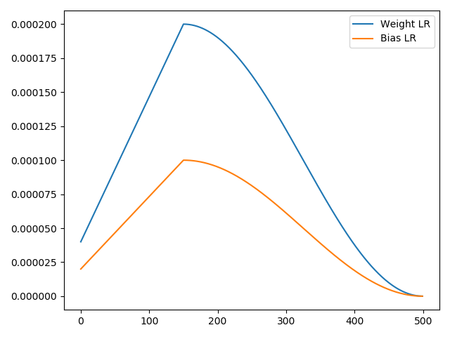

# Holocron

[](LICENSE) [](https://www.codacy.com/manual/fg/Holocron?utm_source=github.com&amp;utm_medium=referral&amp;utm_content=frgfm/Holocron&amp;utm_campaign=Badge_Grade) [](https://circleci.com/gh/frgfm/Holocron) [](https://codecov.io/gh/frgfm/Holocron) [](https://frgfm.github.io/Holocron)

Implementations of recent Deep Learning tricks in Computer Vision, easily paired up with your favorite framework and model zoo.

> **Holocrons** were information-storage [datacron](https://starwars.fandom.com/wiki/Datacron) devices used by both the [Jedi Order](https://starwars.fandom.com/wiki/Jedi_Order) and the [Sith](https://starwars.fandom.com/wiki/Sith) that contained ancient lessons or valuable information in [holographic](https://starwars.fandom.com/wiki/Hologram) form.

*Source: Wookieepedia*


## Installation

This package was developed using minimal dependencies ([pytorch](https://github.com/pytorch/pytorch), [torchvision](https://github.com/pytorch/vision)). 

**User installation**

```bash
pip install git+https://github.com/frgfm/Holocron@master
```

**Developer installation**

```bash
git clone https://github.com/frgfm/Holocron.git
pip install -e Holocron/
```


## Usage

### nn

##### Main features

- Activation: [Mish](https://arxiv.org/abs/1908.08681), [NLReLU](https://arxiv.org/abs/1908.03682)

##### Usage

Similar usage to  `torch.nn`

```python
import torch.nn as nn
from holocron.nn import Mish, NLReLU

# Both modules inherit from torch.nn.Module and can be used as such
model = nn.Sequential(nn.Conv2d(3, 64, (3, 3)),
                      Mish(),
                      nn.Conv2d(64, 128, (3, 3)),
                      NLReLU(),)
```


### models

##### Main features

- Res2Net: [paper](https://arxiv.org/abs/1904.01169), based on the great [implementation](https://github.com/gasvn/Res2Net) from gasvn

##### Usage

Using the models module, you can easily load torch modules or full models:

```python
from holocron.models.res2net import res2net
# Load pretrained Res2net
model = res2net(depth=50, num_classes=10, pretrained=True).eval()
```

Then, let's generate a random input image

```python
import torch
# Get random image
img_tensor = torch.rand(1, 3, 600, 600) 
```

Now we can move them to GPU and forward them

```python
# Move inputs and model to GPU
if torch.cuda.is_available():
    model = model.cuda()
    img_tensor = img_tensor.cuda()
# Forward
with torch.no_grad():
    output = model(img_tensor)
```


### optim

##### Main features

- Optimizer: [LARS](https://arxiv.org/abs/1708.03888), [Lamb](https://arxiv.org/abs/1904.00962), [RAdam](https://arxiv.org/abs/1908.03265) and customized versions (RaLars)
- Optimizer wrapper: [Lookahead](https://arxiv.org/abs/1907.08610)
- Scheduler: [OneCycleScheduler](https://arxiv.org/abs/1803.09820)

##### Usage

The optimizer wrapper can be used on any `torch.optim.optimizer.Optimizer` object 

```python
from torchvision.models.resnet import resnet50
from holocron.optim import RaLars

model = resnet50()
# Common usage of optimizer
optimizer = RaLars(model.parameters(), lr=3e-4)
# Wrap it with Lookahead
optimizer = Lookahead(optimizer, sync_rate=0.5, sync_period=6)

for epoch in range(10):
    # Train for an epoch
    for input, target in dataset:
        optimizer.zero_grad()
        output = model(input)
        loss = loss_fn(output, target)
        loss.backward()
        optimizer.step()
    val_loss = validate(...)
```


You can use the `OneCycleScheduler` as follows:

```python
from torchvision.models.resnet import resnet50
from torch.optim import Adam
from holocron.optim.lr_scheduler import OneCycleScheduler

model = resnet50()
# Let's have different LRs for weight and biases for instance
bias_params, weight_params = [], []
for n, p in model.named_parameters():
	if n.endswith('.bias'):
		bias_params.append(p)
    else:
    	weight_params.append(p)
# We pass the parameters to the optimizer
optimizer = Adam([dict(params=weight_params, lr=2e-4), dict(params=bias_params, lr=1e-4)])

steps = 500
scheduler = OneCycleScheduler(optimizer, steps, cycle_momentum=False)
# Let's record the evolution of LR in each group
lrs = [[], []]
for step in range(steps):
	for idx, group in enumerate(optimizer.param_groups):
		lrs[idx].append(group['lr'])
	# Train your model and perform optimizer.step() here
	scheduler.step()

# And plot the result
import matplotlib.pyplot as plt
plt.plot(lrs[0], label='Weight LR'); plt.plot(lrs[1], label='Bias LR'); plt.legend(); plt.show()
```




### utils

##### Main features

- Activation mapper: [Discriminative Localization](https://arxiv.org/abs/1512.04150) 

##### Usage

The class activation map (CAM) extractor can be used as follows: 

```python
import requests
from PIL import Image
import matplotlib.pyplot as plt
from torchvision.models import resnet50
from torchvision.transforms import transforms
from torchvision.transforms.functional import to_pil_image
from holocron.utils import ActivationMapper, overlay_mask


# Pretrained imagenet model
model = resnet50(pretrained=True).eval()
# Specify layer to hook and fully connected
last_conv_layer = 'layer4'
fc_layer = 'fc'

# Hook the corresponding layer in the model
cam = ActivationMapper(model, last_conv_layer, fc_layer)

# Get a dog image
URL = 'https://www.woopets.fr/assets/races/000/030/mobile/berger-australien.jpg'
response = requests.get(URL)
file_name = URL.split('/')[-1]
with open(file_name, 'wb') as f:
    f.write(response.content)

# Forward an image
pil_img = Image.open(file_name, mode='r').convert('RGB')
preprocess = transforms.Compose([
   transforms.Resize((224,224)),
   transforms.ToTensor(),
   transforms.Normalize([0.485, 0.456, 0.406], [0.229, 0.224, 0.225])
])
img_tensor = preprocess(pil_img)
out = model(img_tensor.unsqueeze(0))

# Select the class index
classes = {int(key):value for (key, value)
          in requests.get('https://s3.amazonaws.com/outcome-blog/imagenet/labels.json').json().items()}
class_idx = 232

# Use the hooked data to compute activation map
activation_maps = cam.get_activation_maps([class_idx])
# Convert it to PIL image
# The indexing below means first image in batch and first requested class
heatmap = to_pil_image(activation_maps[0, 0], mode='F')

# Plot the result
img = Image.open(file_name, mode='r').convert('RGB')
result = overlay_mask(img, heatmap)
plt.imshow(result); plt.axis('off'); plt.title(classes.get(class_idx)); plt.tight_layout; plt.show()
```


## Documentation

The full package documentation is available [here](<https://frgfm.github.io/Holocron/>) for detailed specifications. The documentation was built with [Sphinx](sphinx-doc.org) using a [theme](github.com/readthedocs/sphinx_rtd_theme) provided by [Read the Docs](readthedocs.org) 


## Submitting a request / Reporting an issue

Regarding issues, use the following format for the title:

> [Topic] Your Issue name

Example:

> [models resnet] Add spectral normalization option